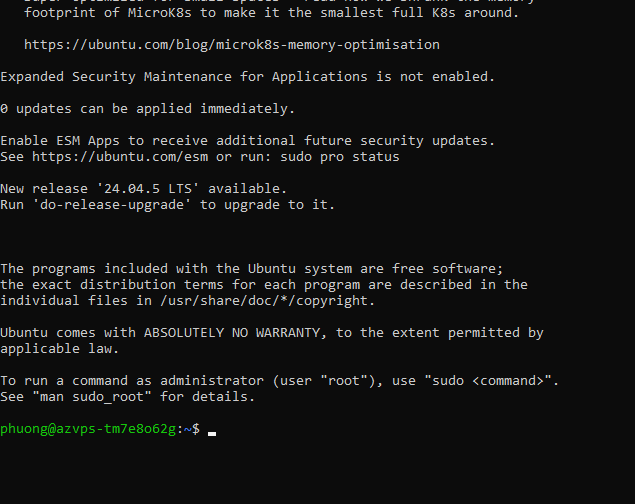
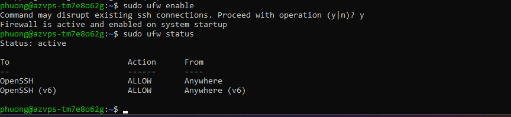

# Bài 1: Thực hành VPS Ubuntu trên AZVPS

> **Trạng thái: Đã có bằng chứng phiên Ubuntu và cấu hình firewall; chưa xác minh xác thực bằng SSH key.**
> Theo xác nhận của học viên, giảng viên cho phép sử dụng AZVPS thay DigitalOcean. Báo cáo ghi lại môi trường thực tế; không coi VPS AZVPS là Droplet DigitalOcean.

## 1. Thông tin bài làm

- Tài khoản GitHub: [hex2k6](https://github.com/hex2k6).
- Họ tên học viên: Bui Van Phuong.
- Repository: [IT209_SS2_01](https://github.com/hex2k6/IT209_SS2_01).
- Bài nộp: [homework/session_02/ex1/](https://github.com/hex2k6/IT209_SS2_01/tree/main/homework/session_02/ex1).
- Mục tiêu: Thực hành máy chủ Ubuntu trên nền tảng được giảng viên cho phép, kết nối SSH từ Windows và xác minh đăng nhập bằng SSH key.

## 2. Môi trường thực tế

| Hạng mục | Thông tin xác nhận được |
| --- | --- |
| Nhà cung cấp | AZVPS, theo thông tin học viên cung cấp |
| Máy cá nhân | Windows, dùng Command Prompt trong ảnh kết nối |
| Hệ điều hành máy chủ | Ubuntu; ảnh hiện có chưa xác định được phiên bản đang chạy |
| Tài khoản trong phiên máy chủ | `phuong` |
| Hostname hiển thị | `azvps-tm7e8o62g` |
| Địa chỉ IP | Đã có trong ảnh kết nối gốc; không công khai trong báo cáo |
| CPU / RAM / Disk | Chưa có thông tin cấu hình xác thực |
| Datacenter / gói / giá | Chưa có thông tin xác thực từ trang quản lý AZVPS |
| Phương thức xác thực SSH | Chưa xác minh là SSH key hay mật khẩu |
| Firewall | UFW active; cho phép OpenSSH với IPv4 và IPv6 |

Thông báo có bản nâng cấp Ubuntu trong ảnh không xác định phiên bản hệ điều hành hiện đang chạy. Báo cáo chưa xác nhận máy chủ đáp ứng yêu cầu Ubuntu 22.04 LTS hoặc mới hơn.

## 3. Các thao tác đã có bằng chứng

### 3.1. Kết nối từ Windows

Ảnh kết nối gốc cho thấy học viên chạy lệnh SSH với tài khoản `phuong`. Dưới đây là dạng lệnh đã che địa chỉ IP, không phải log nguyên bản:

```sh
ssh phuong@<IP_VPS>
```

Ảnh tiếp theo cho thấy thông tin chào mừng Ubuntu và dấu nhắc `phuong@azvps-tm7e8o62g:~$`. Đây là bằng chứng phiên làm việc trên máy chủ; ảnh chưa chứng minh phương thức xác thực bằng SSH key và không thể hiện đăng nhập bằng `root`.



### 3.2. Bật và kiểm tra firewall

Ảnh thực tế ghi lại hai lệnh:

```sh
sudo ufw enable
sudo ufw status
```

UFW báo trạng thái `active`. Quy tắc OpenSSH được cho phép cho cả IPv4 và IPv6.



Hai ảnh trên là ảnh thực tế được học viên cung cấp trong cuộc trò chuyện trước, không phải ảnh minh họa hay kết quả chạy mới.

## 4. Các mục cần hoàn tất để đáp ứng phần SSH key

Đề gốc yêu cầu đăng nhập bằng SSH key với tài khoản `root`. Việc cho phép thay nhà cung cấp chưa xác nhận miễn yêu cầu này. Cần bổ sung bằng chứng phù hợp hoặc xác nhận giảng viên cho phép dùng tài khoản `phuong`.

### 4.1. Kiểm tra hệ điều hành và tài khoản

Trong phiên SSH, chạy các lệnh sau và lưu kết quả thực tế:

```sh
whoami
cat /etc/os-release
```

### 4.2. Xác minh đăng nhập bằng SSH key

Nếu đã tạo khóa và cài public key cho tài khoản đích, chạy từ PowerShell trên máy cá nhân. Thay đường dẫn và IP bằng thông tin thật:

```powershell
ssh -o PreferredAuthentications=publickey -o PasswordAuthentication=no -o KbdInteractiveAuthentication=no -i "C:\duong-dan\private_key" root@<IP_VPS>
```

Lệnh này chỉ thử phương thức public key. Khóa có passphrase vẫn có thể yêu cầu passphrase bảo vệ khóa. Nếu giảng viên chấp nhận tài khoản `phuong`, thay `root` bằng `phuong` và ghi rõ ngoại lệ trong báo cáo.

**Chưa thực hiện/xác minh lệnh kiểm tra trên trong báo cáo này.** Cần bổ sung ảnh hoặc log kết nối thật. Không đưa nội dung private key, mật khẩu hay token lên GitHub.

### 4.3. Bổ sung thông tin triển khai

- Ngày thực hành.
- Cấu hình, region, gói và giá VPS từ trang quản lý AZVPS.
- Các bước tạo VPS và thiết lập public key đã thực sự thực hiện.
- Kết quả xác minh SSH key và tài khoản dùng để nộp bài.

## 5. Đối chiếu yêu cầu

| Yêu cầu | Trạng thái |
| --- | --- |
| Nhà cung cấp DigitalOcean | Được thay bằng AZVPS theo xác nhận của học viên về sự cho phép của giảng viên |
| Ubuntu 22.04 LTS hoặc mới hơn | Có phiên Ubuntu; cần xác minh phiên bản |
| Singapore và cấu hình tiết kiệm | Chưa có bằng chứng; cần ghi cấu hình thực tế và yêu cầu thay thế được chấp nhận |
| Tạo và sử dụng cặp khóa SSH | Chưa có bằng chứng |
| Kết nối SSH từ máy cá nhân | Có ảnh lệnh kết nối và ảnh phiên Ubuntu trong tài liệu gốc |
| Đăng nhập bằng root | Ảnh hiện có dùng `phuong`; cần kiểm tra lại yêu cầu |
| Bằng chứng thực hành | Đã đính kèm ảnh phiên Ubuntu và UFW |
| Đúng thư mục GitHub | `homework/session_02/ex1/README.md` |

## 6. Kết quả hiện tại

Đã có phiên làm việc Ubuntu với tài khoản `phuong` và firewall hoạt động, cho phép SSH. Báo cáo chưa đánh dấu hoàn thành bài SSH-key cho đến khi bổ sung kết quả xác minh thực tế và các thông tin còn thiếu.


